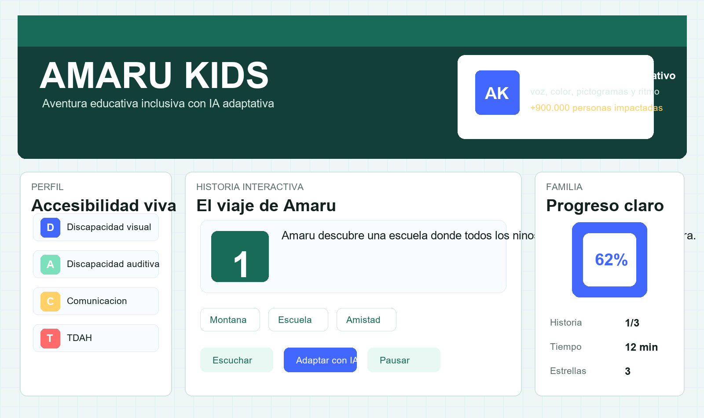

# AMARU KIDS

AMARU KIDS es una plataforma educativa inclusiva impulsada por inteligencia artificial adaptativa. Su objetivo es que ninos con discapacidad visual, discapacidad auditiva, dificultades del habla, TDAH o necesidades educativas especificas puedan acceder al aprendizaje digital de forma autonoma, motivadora y segura.

> "La tecnologia tambien debe sentirse, escucharse y comprenderse."



## Estado del MVP

El MVP esta en fase de prototipo funcional para hackathon. Actualmente permite probar la experiencia educativa principal en navegador y deja preparada la conexion con Firebase y Gemini AI mediante variables de entorno.

Estado actual:

- Interfaz React + Vite creada.
- Matriz de adaptacion inteligente con tres perfiles base: visual, auditivo y cognitivo/TDAH.
- Historia interactiva adaptada funcional.
- Lectura asistida por voz funcional en navegadores compatibles.
- Modo visual inclusivo, apoyo visual, pictogramas y ajuste de texto funcionales.
- Vibracion inteligente en dispositivos compatibles.
- Recompensas y panel familiar basico funcionales.
- Firebase preparado para guardar progreso cuando se agreguen claves reales.
- Gemini AI preparado para generar variaciones simples del texto de la historia cuando se agregue una clave real.

## Entregables

- Demo publica: https://danielaamarukids.github.io/AMARU-KIDS-2/
- Repositorio: https://github.com/DanielaAmaruKids/AMARU-KIDS-2
- Video demo publico: https://danielaamarukids.github.io/AMARU-KIDS-2/video/amaru-kids-demo.mp4
- Video demo en Drive: https://drive.google.com/file/d/1Oe38QwXSkeBjq6SiMEabM-QQk22oG5BG/view?usp=share_link
- [Entrega final](docs/ENTREGA_FINAL.md)
- [Entregables Semana 3](docs/ENTREGABLES_SEMANA3.md)
- [Pitch deck final PDF](docs/pitch.pdf)
- [Pitch deck final](docs/pitch/amaru-kids-pitch-final.pptx)
- [Infografia oficial](docs/infografia.png)
- [Infografia editable/referencia](docs/infografia/amaru-kids-infografia.png)
- [Whitepaper v1.0](docs/WHITEPAPER.md)
- [Whitepaper v1.0 PDF](docs/whitepaper_v1.pdf)
- [Maqueta del MVP](docs/MAQUETA.md)
- [Pitch de presentacion](docs/PITCH.md)
- [Video demo Semana 2](docs/video/amaru-kids-demo-s2.mp4)
- [Tablero Kanban](docs/KANBAN.md)
- [Preguntas del jurado](docs/PREGUNTAS_JURADO.md)
- [Confirmacion publica Firebase/Gemini](docs/CONFIRMACION_PUBLICA.md)

## Entregables Semana 3

La entrega final incluye:

- Pitch deck final de 12 diapositivas.
- Pitch deck final en PDF en `docs/pitch.pdf`.
- Infografia visual del proyecto.
- Infografia oficial en `docs/infografia.png`.
- Whitepaper v1.0 en Markdown y PDF en `docs/whitepaper_v1.pdf`.
- Preguntas y respuestas para jurado.
- README con enlaces finales.
- MVP publicado en GitHub Pages.
- Funcion de IA visible dentro de la historia interactiva.
- Firebase y Gemini preparados para funcionar con variables seguras.

## Video demo

El video demo de 2 minutos muestra:

- Problema en 1 oracion.
- Pantalla principal.
- Flujo del MVP.
- Funcion de IA/adaptacion.
- Impacto ODS.
- Nombre del equipo.

## Problema

En Ecuador, mas de 1 millon de personas presentan dificultades funcionales permanentes. Entre ellas hay ninos con barreras visuales, auditivas, comunicacionales o de atencion que necesitan herramientas tecnologicas adaptadas para acceder a educacion de calidad.

Muchas aplicaciones educativas son costosas, dificiles de usar, estan pensadas para una sola discapacidad o no responden al contexto latinoamericano.

AMARU KIDS nace para reducir esa brecha desde la infancia: no busca que los ninos se adapten a la tecnologia, sino que la tecnologia se adapte a cada nino.

## MVP

La primera version valida una experiencia educativa inclusiva con el lema "Leer tambien es jugar":

- Seleccion de necesidad: modo visual, modo auditivo y modo cognitivo/TDAH.
- Historia interactiva accesible: "Luna y el colibri magico".
- Lectura asistida por voz mediante Text-to-Speech del navegador.
- Modo visual inclusivo con alto contraste y ajuste de texto.
- Pictogramas de apoyo para comunicacion y comprension.
- Vibracion inteligente para refuerzo y ayuda.
- Sistema inicial de recompensas.
- Panel familiar basico con avance, tiempo de uso y estrellas.
- Mascota oficial AMARU como guia de historias y recompensas.
- Estructura Firebase demostrable con nombre, edad, perfil, estrellas, historias completadas y ultima sesion.

Fuera del MVP por ahora:

- Comunidad online.
- Compras dentro de la app.
- Chat avanzado de IA.

## Mascota oficial

La mascota oficial se llama AMARU. Es una serpiente andina amigable, colorida y sonriente que guia las historias, entrega recompensas y fortalece la identidad ecuatoriana y latinoamericana del proyecto.

Frase de AMARU: "Aprendamos juntos".

## Tecnologias

- Frontend: React + Vite.
- Backend propuesto: Firebase.
- Inteligencia artificial propuesta: Gemini AI para adaptar frases simples y generar variantes con pictogramas.
- Diseno: Figma.
- Control de versiones: GitHub.

## Estructura Firebase del MVP

Ejemplo de datos que puede guardar el reporte familiar:

```json
{
  "nombre": "Mateo",
  "edad": 7,
  "perfil": "auditivo",
  "estrellas": 12,
  "historias_completadas": 4,
  "ultima_sesion": "2026-05-25"
}
```

## Indicadores de impacto

| Indicador | Meta |
| --- | --- |
| Ninos que usan la app | 100 |
| Historias completadas | 500 |
| Estrellas obtenidas | 1000 |
| Escuelas participantes | 5 |
| Tiempo promedio de lectura | 10 min |

## Estructura

```text
amaru-kids/
  src/
    data/
      story.js
    services/
      adaptiveEngine.js
      firebase.js
      gemini.js
    App.jsx
    main.jsx
    styles.css
  docs/
    screenshots/
      amaru-kids-mvp.png
    PROYECTO.md
  .env.example
  index.html
  package.json
```

## Ejecutar el proyecto

```bash
npm install
npm run dev
```

Luego abre la URL local que muestre Vite.

## Variables de entorno

Copia `.env.example` como `.env` y completa las claves reales:

```bash
VITE_FIREBASE_API_KEY=
VITE_FIREBASE_AUTH_DOMAIN=
VITE_FIREBASE_PROJECT_ID=
VITE_FIREBASE_STORAGE_BUCKET=
VITE_FIREBASE_MESSAGING_SENDER_ID=
VITE_FIREBASE_APP_ID=
VITE_GEMINI_API_KEY=
```

Sin estas claves, la app funciona como prototipo local y guarda el progreso en el navegador.

Para activar Firebase y Gemini en la pagina publica de GitHub Pages, revisa:

- [Configuracion publica](docs/CONFIGURACION_PUBLICA.md)

## Firebase y Gemini

Firebase y Gemini ya estan integrados en codigo y se activan cuando existen las variables `VITE_*` correspondientes.

Estado actual:

- Firebase / Firestore creado para el proyecto.
- Gemini API probado localmente.
- La demo publica esta preparada para recibir las claves desde GitHub Actions Secrets.
- No se publican claves privadas en el repositorio.

Para confirmar funcionamiento en la pagina publica, agrega los secretos `VITE_FIREBASE_*` y `VITE_GEMINI_API_KEY` en GitHub, vuelve a ejecutar el despliegue de GitHub Pages y prueba el flujo del MVP desde la URL publica.

## Despliegue

Opciones recomendadas para publicar la demo:

- GitHub Pages: este repositorio incluye `.github/workflows/deploy-pages.yml`.
- Vercel: importar el repositorio, elegir Vite y publicar.
- Netlify: conectar el repositorio y usar `npm run build` con carpeta `dist`.

Para GitHub Pages, activa **Settings > Pages > Source > GitHub Actions** y vuelve a ejecutar el workflow si hace falta.

## Roadmap

- Fase 1: investigacion, diseno de wireframes y arquitectura inclusiva.
- Fase 2: desarrollo del MVP con tres perfiles adaptativos, historia, audio, pictogramas y reporte familiar.
- Fase 3: piloto local con escuelas del Distrito Metropolitano de Quito, familias y centros terapeuticos.
- Fase 4: escalamiento nacional.
- Fase 5: expansion latinoamericana.

## Equipo

- Abigail Flores: lider del proyecto.
- Marthina Correa: diseno e investigacion UX/UI.
- Luciana Penaherrera: innovacion y tecnologia.
- Daniela: mentora pedagogica.
